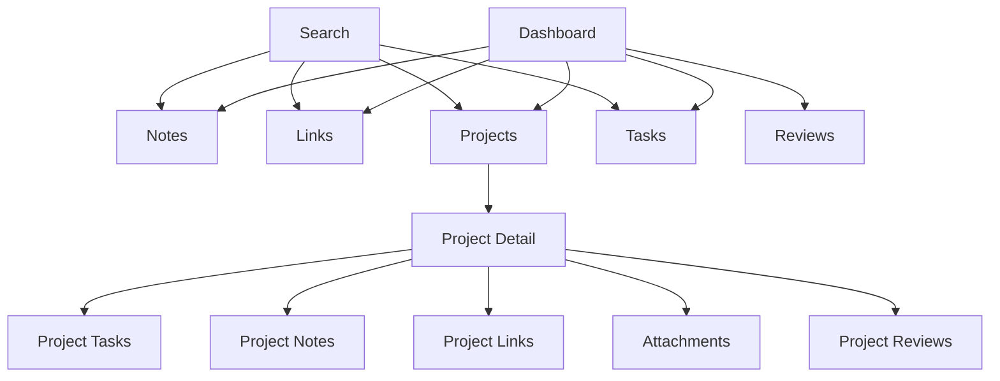

# 开发者个人知识与项目中枢 Design

## 1. 设计目标

本设计文档基于 `developer-knowledge-hub-prd.md` 编写，面向一个个人开发者长期使用的知识管理、项目推进与学习复盘工作台。产品不做公开内容平台，也不做团队协作系统；第一阶段应服务一个人的深度工作流：快速记录、持续整理、围绕项目推进任务，并在周期回顾中看见长期积累。

整体体验关键词：

- **高级但不炫技**：用清晰层级、克制配色、稳定布局、精细状态反馈和高质量排版制造质感。
- **专注但不冰冷**：界面低噪声，但通过项目进展、最近活动和回顾内容让系统有个人温度。
- **输入低摩擦**：笔记、链接、任务都能以最少字段快速创建，整理动作可以稍后完成。
- **结构渐进**：标签、项目、状态、关联任务、附件等信息逐步补全，不强迫用户一开始填满表单。
- **项目驱动知识**：项目是上下文中心，笔记、链接、任务、附件和回顾都应能回到项目详情。
- **搜索优先**：长期知识系统的核心不是复杂目录树，而是可搜索、可过滤、可关联。

## 2. 产品气质

界面应像一个“开发者的私人控制台”：有 IDE 的秩序感、知识库的沉淀感、任务看板的推进感，以及复盘工具的安静感。

它不应该像营销型 SaaS 首页，也不应该像模板化后台。第一屏应该直接进入工作台，而不是介绍产品功能。

设计隐喻：

- **控制台**：清晰、稳定、可扫描。
- **工作台**：快速放入材料，之后再整理。
- **档案库**：内容长期沉淀，可被搜索和回看。
- **项目室**：所有资料最终围绕项目形成上下文。

视觉方向参考 `x.ai.design.md` 的工程化克制感：近黑画布、白色细线、胶囊形交互、无阴影卡片、极少强调色和单纯排版。需要注意的是，本产品是长期使用的应用工作台，不是品牌官网，因此应吸收它的“稀薄、锋利、冷静”，但保留足够的信息密度、状态识别和表单可用性。

默认主题采用 **near-black canvas only** 的深色工作台。浅色主题可以作为后续无障碍或个人偏好扩展，但不进入 MVP 主视觉。高级感来自统一的黑白层级，而不是多色装饰。

美学关键词：

- **Near-black canvas**：页面以接近纯黑的画布承载所有内容。
- **White-line system**：主要交互使用白色半透明描边，而不是大面积填色。
- **Hairline depth**：空间层级依赖 1px 细边框，不依赖阴影。
- **Pill interactions**：按钮、筛选 chips、命令入口采用统一胶囊形。
- **Mono labels**：小标签、指标、状态辅助文案使用等宽字体，形成工程感。
- **Sparse accents**：强调色只服务状态、图标或极少量数据，不成为主视觉。

## 3. 信息架构

### 3.1 主导航

采用左侧固定导航，适合桌面端长时间工作。

主导航：

- Dashboard
- Notes
- Links
- Projects
- Tasks
- Search
- Reviews
- Settings

全局顶部区域：

- 全局搜索入口
- 快速创建入口
- 当前用户入口
- 主题切换

快速创建入口包含：

- 新建笔记
- 新建链接
- 新建任务
- 新建项目

### 3.2 核心对象关系

核心对象：

- Project：上下文中心，组织任务、笔记、链接、附件、回顾和活动。
- Note：知识沉淀，支持 Markdown、标签、项目和任务关联。
- Link：资料收藏，支持 URL、标题、描述、阅读状态、标签和项目。
- Task：行动推进，支持状态、优先级、截止日期、项目和笔记关联。
- Tag：横向组织线索，可绑定到笔记、链接、项目和任务。
- Review：周期复盘，包括周回顾和项目回顾。
- Attachment：补充材料，可挂载到笔记、项目或回顾。
- ActivityLog：支撑 Dashboard、项目时间线和周回顾自动聚合。



## 4. 布局系统

### 4.1 桌面端框架

桌面端是 MVP 的主战场。

推荐规格：

- 左侧导航栏：240px。
- 顶部工具栏：64px。
- 内容区最大宽度：1440px。
- 页面左右内边距：32px。
- 主内容网格：12 columns。
- 间距基准：4px。
- 常用间距：8 / 12 / 16 / 24 / 32。

页面结构：

```text
+-------------------------------------------------------------+
| Sidebar | Topbar                                            |
|         |---------------------------------------------------|
|         | Page title / actions                              |
|         |---------------------------------------------------|
|         | Main content                                      |
+-------------------------------------------------------------+
```

布局原则：

- 页面不使用大面积嵌套卡片。
- 区块使用标题、间距、弱边框和背景层级区分。
- 列表保持稳定行高，减少 hover 或加载造成的布局跳动。
- 工具型页面优先保证扫描效率，不做装饰性大标题。

### 4.2 移动端策略

MVP 不以移动端为核心，但需要保证基础可用。

- 侧边栏收起为抽屉或底部导航。
- 全局搜索保留在顶部。
- 快速创建使用明显入口。
- 项目看板在移动端改为状态 Tabs。
- 编辑器默认单栏。
- 多列表格改为列表卡片。

## 5. 视觉系统

### 5.1 视觉原则

主视觉采用近黑单画布，整体接近 xAI 式的 engineered restraint：少色、少形、少阴影，用字体、边框、间距和状态建立高级感。

核心原则：

- **黑色不是背景，而是产品表面**：默认页面背景为接近纯黑的 `#0A0A0A`，所有内容在其上以轻微层级浮现。
- **白色是主要品牌色**：主文本、按钮描边、关键图标和选中态都以白色或半透明白色表达。
- **卡片不漂浮**：不使用投影，所有层级通过 1px hairline border 和轻微明度差表达。
- **胶囊是交互形状**：按钮、筛选项、命令入口、状态 chips 使用 pill 形态，形成统一的交互语言。
- **8px 是内容容器形状**：卡片、输入框、编辑器面板使用 8px 圆角，保持工具感，不做过度柔软。
- **强调色被严格保留**：状态色只用于任务、项目、风险、成功等语义，不用于装饰。

### 5.2 色彩

MVP 主主题为深色，不建议在第一版投入浅色主题。浅色主题会削弱参考风格中的高识别度，也会增加设计和实现成本。

#### Core Tokens

| Token | 用途 | 色值 |
| --- | --- | --- |
| `--canvas` | 全局页面画布 | `#0A0A0A` |
| `--canvas-soft` | 轻微抬升表面 / hover | `#111214` |
| `--canvas-card` | 卡片与面板 | `#191919` |
| `--canvas-mid` | 嵌套区域 / 代码背景 | `#25272B` |
| `--hairline` | 细边框 / 分割线 | `#24262A` |
| `--hairline-strong` | 强边框 / 当前项 | `rgba(255,255,255,0.25)` |
| `--white` | 主文本 / 主图标 | `#FFFFFF` |
| `--body` | 正文辅助文本 | `#DADBDD` |
| `--muted` | 弱文本 / 时间 / 描述 | `#7D8187` |
| `--disabled` | 禁用文本 | `#4E5258` |

#### Accent Tokens

强调色使用低频、低面积，主要用于状态、图标和少量数据可视化。

| Token | 用途 | 色值 |
| --- | --- | --- |
| `--accent-sunset` | 高优先级 / 警示强调 | `#FF7A17` |
| `--accent-dusk` | 重点项目 / 选中辅助 | `#7C3AED` |
| `--accent-twilight` | 标签辅助 | `#C4B5FD` |
| `--accent-breeze` | 信息 / 链接辅助 | `#A0C3EC` |
| `--success` | 完成 | `#45D483` |
| `--warning` | 暂停 / 临近截止 | `#F5B84B` |
| `--danger` | 删除 / 失败 / 逾期 | `#FF6B6B` |

使用规则：

- 页面背景只使用 `--canvas`，不要使用渐变背景、光斑、装饰色块。
- 卡片使用 `--canvas-card`，嵌套区域使用 `--canvas-mid`。
- 主要按钮默认使用白色描边 pill，不大面积使用填充色。
- 唯一允许的填充主按钮是“极关键提交”，如登录、新建保存确认，可使用白底黑字 pill。
- 状态色必须有文本或图标辅助，不能只靠颜色表达。

### 5.3 字体

字体系统参考 xAI 的双字体对比：几何无衬线负责主体，等宽字体负责标签、状态和指标。

推荐字体：

- Display / UI：Geist Sans / Inter / system-ui。
- Mono：Geist Mono / JetBrains Mono / ui-monospace。
- 中文：系统默认中文字体，跟随无衬线系统栈。

字号建议：

| Token | Size | Weight | Line Height | Letter Spacing | 用途 |
| --- | --- | --- | --- | --- | --- |
| `display-lg` | 48px | 400 | 52px | -0.03em | 登录页标题 / Dashboard 关键标题 |
| `display-md` | 32px | 400 | 38px | -0.02em | 页面标题 / 项目详情标题 |
| `title-lg` | 24px | 400 | 32px | -0.01em | 区块标题 |
| `title-md` | 18px | 400 | 26px | 0 | 卡片标题 / 列表主标题 |
| `body-md` | 14px | 400 | 22px | 0 | 常规正文 |
| `body-sm` | 13px | 400 | 20px | 0 | 次级信息 |
| `caption-mono` | 12px | 400 | 16px | 0.10em | 标签、状态、eyebrow、指标说明 |
| `code` | 13px | 400 | 20px | 0 | 代码块 |

排版原则：

- 尽量使用 400 字重，减少粗体依赖。
- 大标题通过字号与负字距建立精密感，不通过加粗制造强调。
- 小标签、指标、状态、筛选组标题使用等宽大写样式。
- 中文内容不强行使用过大负字距，避免可读性下降。

### 5.4 图标

使用 lucide-react 风格线性图标，图标 stroke 保持 1.75px 或 2px。

- Notes：FileText。
- Links：Link。
- Projects：FolderKanban。
- Tasks：CheckSquare。
- Search：Search。
- Reviews：BookOpenCheck。
- Settings：Settings。
- New：Plus。
- Favorite：Star。
- Archive：Archive。
- Upload：Upload。

图标规范：

- 图标按钮必须使用 tooltip 或 aria-label。
- 图标默认白色或 muted，不使用彩色图标作为装饰。
- 状态图标可以使用语义色，但面积要小。

### 5.5 形状与层级

| Token | Value | 用途 |
| --- | --- | --- |
| `--radius-none` | `0px` | 全宽区域 / 分割线 |
| `--radius-sm` | `8px` | 卡片、输入框、面板 |
| `--radius-pill` | `9999px` | 按钮、chips、筛选项 |
| `--radius-full` | `9999px` | 圆形图标容器 |

层级规则：

- Level 0：纯 `--canvas`，无边框。
- Level 1：`--canvas-card` + 1px `--hairline`，用于卡片和面板。
- Level 2：`--canvas-soft` + `--hairline-strong`，用于当前项、hover、命令面板。
- 不使用 drop-shadow 作为默认层级。
## 6. 核心页面设计

### 6.1 登录页

目标：简洁、安全、有质感。

布局：

- 居中登录面板。
- 表单宽度不超过 360px。
- 背景可使用深色细网格或非常轻的噪点纹理。
- 产品名称明确出现。

内容：

- 邮箱。
- 密码。
- 登录按钮。
- 错误提示。

设计要求：

- 不做营销式 Hero。
- 错误提示清晰，但不泄露敏感信息。
- 登录成功后进入 Dashboard。

### 6.2 Dashboard

Dashboard 是打开系统后的第一屏，应直接呈现个人工作状态。

推荐模块：

- 今日待办。
- 活跃项目。
- 最近编辑笔记。
- 最近保存链接。
- 本周完成任务数。
- 快速创建入口。

布局建议：

```text
+-------------------------------------------------------------+
| Header: Greeting / Search / Quick create                    |
+-----------------------------+-------------------------------+
| Today Focus                 | Weekly Pulse                  |
+-----------------------------+-------------------------------+
| Active Projects                                             |
+-----------------------------+-------------------------------+
| Recent Notes                | Recent Links                  |
+-----------------------------+-------------------------------+
```

高级感细节：

- “本周完成”使用紧凑数据条，不做夸张统计卡。
- 活跃项目显示状态、技术栈、未完成任务和最近活动。
- 最近内容显示摘要与关联项目，强化上下文。
- 快速创建按钮始终清晰，但不喧宾夺主。

### 6.3 Notes

笔记列表需要兼顾扫描和筛选。

页面结构：

- 顶部：标题、搜索、筛选、新建。
- 左侧可选筛选栏：标签、项目、收藏、更新时间。
- 主区：笔记列表。

列表项字段：

- 标题。
- 摘要。
- 标签。
- 所属项目。
- 更新时间。
- 收藏状态。

交互：

- 点击列表项进入编辑页。
- 收藏按钮可直接切换。
- 筛选条件以 chips 显示，可一键清除。

### 6.4 Note Editor

编辑器是产品核心体验之一，应保持安静、稳定、可信赖。

布局：

- 顶部：标题输入、保存状态、更多操作。
- 主区：Markdown 编辑与预览。
- 右侧：属性面板。

属性面板包含：

- 所属项目。
- 标签。
- 关联任务。
- 收藏。
- 附件。
- 创建时间与更新时间。

编辑模式：

- Edit。
- Preview。
- Split。

关键体验：

- 自动保存显示“已保存 / 保存中 / 保存失败”。
- 离开页面前处理未保存变更。
- 代码块使用高质量语法高亮。
- 支持软删除和二次确认。

### 6.5 Links

链接库是资料收集入口。

列表项字段：

- 标题。
- 域名。
- 描述。
- 阅读状态。
- 标签。
- 所属项目。
- 创建时间。

新建链接流程：

1. 输入 URL。
2. 系统解析标题和域名。
3. 用户补充描述、标签、项目和阅读状态。
4. 保存后进入链接库和项目详情。

交互细节：

- URL 重复时提示“已保存过”，并提供打开已有链接。
- 解析失败时允许手动填写标题和描述。
- 阅读状态可在列表中快速切换。

### 6.6 Projects

项目列表展示用户的长期工作主线。

项目卡片内容：

- 名称。
- 目标摘要。
- 状态。
- 技术栈。
- 未完成任务数。
- 最近活动。
- 开始日期。

筛选：

- 状态。
- 技术栈。
- 是否归档。

排序：

- 最近活动。
- 创建时间。
- 名称。

### 6.7 Project Detail

项目详情是多对象聚合页，是“项目驱动知识”的关键页面。

顶部区域：

- 项目名称。
- 状态。
- 技术栈。
- 项目目标。
- 快速操作：新建任务、新建笔记、保存链接、写回顾。

Tabs：

- Overview。
- Tasks。
- Notes。
- Links。
- Attachments。
- Reviews。
- Activity。

Overview 内容：

- 项目目标。
- 当前任务。
- 最近笔记。
- 最近链接。
- 最近活动。
- 阶段回顾入口。

Tasks Tab：

- 三列看板：待处理 / 进行中 / 已完成。
- 支持拖拽切换状态。
- 卡片显示优先级、截止日期和关联笔记。

Activity Tab：

- 按日期分组的时间线。
- 展示任务完成、笔记创建、链接保存和项目状态变化。

### 6.8 Tasks

任务页用于集中处理行动项。

视图：

- List。
- Board。
- Today。

列表字段：

- 标题。
- 状态。
- 优先级。
- 项目。
- 截止日期。
- 更新时间。

交互：

- 快速切换状态。
- 按项目、状态、优先级和截止日期筛选。
- 逾期任务使用弱红色提示。
- 已完成任务弱化但保留可见性。

### 6.9 Search

搜索是系统的一等入口，不是附属功能。

搜索结果结构：

- 顶部搜索框。
- 类型筛选。
- 标签筛选。
- 项目筛选。
- 时间范围。
- 结果列表。

结果项字段：

- 类型图标。
- 标题。
- 命中摘要。
- 关联项目。
- 标签。
- 更新时间。

MVP 搜索体验：

- 输入防抖。
- 空查询显示最近访问或推荐筛选。
- 无结果时提供创建入口。

### 6.10 Reviews

回顾页需要有沉淀感，帮助用户从长期项目和学习中看到变化。

回顾列表字段：

- 标题。
- 类型：周回顾 / 项目回顾。
- 日期范围。
- 关联项目。
- 摘要。

周回顾编辑布局：

- 左侧：自动聚合内容。
- 右侧：回顾正文。

自动聚合内容：

- 完成任务。
- 新建笔记。
- 保存链接。
- 项目状态变化。

正文结构建议：

- 本周完成。
- 卡住的问题。
- 学到什么。
- 下周计划。

## 7. 组件规范

### 7.1 Button

按钮系统采用统一 pill 形状，这是参考规范中最强的视觉锚点。除少数危险确认外，按钮形状不变化。

按钮类型：

- **Primary Filled**：白底黑字 pill，仅用于登录、最终保存、创建确认等关键动作。
- **Outline On Dark**：白色半透明描边 pill，是默认按钮样式。
- **Ghost Pill**：透明背景 pill，用于导航项、工具栏轻操作。
- **Danger Outline**：红色半透明描边 pill，用于删除入口。
- **Icon Pill**：固定宽高的 pill 或圆形按钮，用于工具图标。

规范：

- 高度：32px / 36px / 40px。
- 圆角：9999px。
- 边框：1px `rgba(255,255,255,0.25)`。
- 字重：400。
- 文本：14px / 20px。
- 不在常规按钮上使用阴影。
- 不使用大面积品牌色填充按钮。

### 7.2 Search / Command Menu

全局搜索与命令面板是产品的高级感入口，应像开发者工具的 command palette。

视觉：

- 背景：`--canvas-card`。
- 边框：1px `--hairline-strong`。
- 圆角：8px。
- 输入框为深色面板，不使用白底。
- 类型标签使用 mono uppercase。

功能：

- 快捷键：`Ctrl K` / `Cmd K`。
- 支持内容搜索。
- 支持快速跳转页面。
- 支持新建笔记、链接、任务。
- 展示最近访问和最近搜索。

### 7.3 Card

卡片遵循“无阴影、细边框、轻明度差”的规则。

默认卡片：

- 背景：`--canvas-card`。
- 边框：1px `--hairline`。
- 圆角：8px。
- 内边距：24px。
- 无投影。

紧凑列表项：

- 背景：透明或 `--canvas`。
- Hover：`--canvas-soft`。
- 边框：只使用底部分割线或 hover 边框。
- 圆角：8px。

使用原则：

- 不把整个页面包成大卡片。
- 卡片用于项目、最近笔记、最近链接、回顾摘要等独立对象。
- 信息密集列表优先使用行式布局，而不是大量卡片堆叠。

### 7.4 Input / Form

输入框需要和黑色画布融为一体，避免传统后台表单感。

- 背景：`--canvas-soft`。
- 边框：1px `--hairline`。
- Focus：边框变为 `--hairline-strong`，不使用发光阴影。
- 圆角：8px。
- 高度：36px / 40px。
- 文本：`--white`。
- Placeholder：`--muted`。

Markdown 编辑器：

- 编辑区背景使用 `--canvas` 或 `--canvas-card`。
- 代码块背景使用 `--canvas-mid`。
- 工具栏按钮使用 icon pill。
- 保存状态使用 mono caption。

### 7.5 Tag / Chip

标签和筛选项采用 pill 系统，但颜色必须克制。

- 背景：透明或 `rgba(255,255,255,0.04)`。
- 边框：1px `rgba(255,255,255,0.16)`。
- 圆角：9999px。
- 文本：12px mono 或 13px sans。
- 标签色以小圆点呈现，不大面积填充。

交互：

- 点击标签进入筛选。
- 编辑页中支持搜索、创建和移除。
- 删除按钮使用小型 icon，不使用文字按钮。

### 7.6 Status Badge

状态徽标使用 mono uppercase 或短中文状态，外观保持 pill。

项目状态：

- 计划中：muted gray。
- 进行中：breeze blue。
- 暂停：warning amber。
- 完成：success green。
- 归档：muted gray。

任务状态：

- 待处理：muted gray。
- 进行中：breeze blue。
- 已完成：success green。
- 已取消：muted gray。

优先级：

- 低：muted gray。
- 中：warning amber。
- 高：sunset orange / danger red。

### 7.7 Empty State

空状态保持极简，不使用大插画。

- 使用一个线性图标。
- 标题 18px regular。
- 描述使用 muted body。
- CTA 使用 outline pill。

示例：

- 标题：还没有笔记。
- 描述：先记录一个问题、想法或代码片段。
- 行动：新建笔记。

### 7.8 Loading

- 列表、卡片和详情页使用 skeleton。
- Skeleton 颜色为 `--canvas-soft` 到 `--canvas-mid` 的轻微变化。
- 首屏骨架与真实布局一致。
- 局部操作使用按钮内 loading。
- 搜索结果使用防抖，减少闪烁。
## 8. 关键交互

### 8.1 快速创建

全局快速创建支持：

- New Note。
- New Task。
- New Link。
- New Project。

行为：

- 默认只要求最少字段。
- 可选择项目和标签。
- 创建完成后提供“继续编辑”和“再建一个”。

### 8.2 渐进式整理

最低字段：

- 笔记：标题或正文。
- 链接：URL。
- 任务：标题。
- 项目：名称。

之后可补充：

- 标签。
- 项目。
- 关联任务。
- 描述。
- 附件。

### 8.3 关联选择器

在笔记、链接、任务详情中都可以选择关联项目。

关联选择器要求：

- 支持搜索。
- 显示最近使用项目。
- 支持清除。
- 支持新建项目后直接关联。

### 8.4 保存状态

编辑类页面展示：

- 未保存。
- 保存中。
- 已保存。
- 保存失败。

保存失败处理：

- 保留本地输入。
- 提供重试。
- 提示不要刷新页面。

### 8.5 删除状态

删除流程：

1. 点击删除。
2. 二次确认。
3. 删除成功提示。
4. 提供短时间撤销入口。

## 9. 可访问性

基础要求：

- 所有交互元素可键盘访问。
- Focus ring 清晰可见。
- 文本对比度满足 WCAG AA。
- 图标按钮必须有 aria-label。
- 表单错误需要与字段关联。
- 状态不能只依赖颜色表达。

## 10. 前端实现建议

推荐技术栈：

- Next.js App Router。
- TypeScript。
- Tailwind CSS。
- shadcn/ui。
- TanStack Query。
- Zustand。
- React Hook Form。
- Zod。
- MDXEditor 或 TipTap。
- lucide-react。

目录结构建议：

```text
apps/web
  app
    (auth)
    (workspace)
      dashboard
      notes
      links
      projects
      tasks
      search
      reviews
      settings
  components
    ui
    layout
    notes
    projects
    tasks
    tags
  features
    auth
    notes
    links
    projects
    tasks
    search
    reviews
  lib
    api
    query
    validation
    utils
  styles
```

前端数据策略：

- 列表页使用 TanStack Query 管理缓存与分页。
- 表单使用 React Hook Form + Zod。
- 全局 UI 状态使用 Zustand，例如主题、命令面板、侧边栏展开状态。
- 创建、更新、删除后做乐观更新或局部失效。
- 编辑器自动保存需要防抖，并处理保存冲突。

## 11. 后端实现建议

采用清晰单体架构，不做过早微服务化。

分层：

- Controller：请求入口、参数校验、身份上下文。
- Service：业务规则、权限边界、事务。
- Repository：数据访问。
- Entity：数据库模型。
- DTO：接口输入输出。
- Mapper：Entity 与 DTO 转换。

模块划分：

```text
auth
users
projects
notes
links
tasks
tags
attachments
reviews
search
activity
common
```

安全原则：

- 后端从认证上下文读取 userId。
- 所有查询必须带 userId 边界。
- 文件上传限制大小、类型和路径。
- 登录失败需要基础限流。
- 删除、归档、状态变更记录 ActivityLog。

## 12. 数据设计补充

TagBinding 使用多态目标：

- targetType：NOTE / LINK / PROJECT / TASK。
- targetId：目标资源 ID。

Attachment 使用多态目标：

- targetType：NOTE / PROJECT / REVIEW。
- targetId：目标资源 ID。

ActivityLog 用于支撑 Dashboard、项目时间线和周回顾。

推荐记录：

- NOTE_CREATED。
- NOTE_UPDATED。
- LINK_SAVED。
- TASK_CREATED。
- TASK_COMPLETED。
- PROJECT_CREATED。
- PROJECT_STATUS_CHANGED。
- REVIEW_CREATED。
- ATTACHMENT_UPLOADED。

## 13. 动效规范

动效应克制、快速、稳定。

- Hover：120ms。
- Modal / Drawer：180ms。
- Page transition：可不做或极轻。
- Toast：进入 160ms，退出 120ms。
- Drag board：保持跟手，不做夸张弹性。

动效原则：

- 只帮助用户理解状态变化。
- 不让用户等待动画结束。
- 长列表滚动不做重动画。

## 14. 内容文案

文案风格：

- 简短。
- 明确。
- 不说教。
- 不使用营销口吻。

示例：

- 保存成功：已保存。
- 自动保存中：保存中...
- 保存失败：保存失败，请重试。
- 空笔记：还没有笔记。
- 空项目：创建一个项目，把任务、笔记和资料放到同一个上下文里。
- 删除确认：删除后这条内容会进入回收状态。

## 15. MVP 设计交付范围

优先完成以下页面：

1. 登录页。
2. Dashboard。
3. Notes 列表。
4. Note Editor。
5. Projects 列表。
6. Project Detail。
7. Tasks 列表或项目看板。
8. Links 列表与新建链接。
9. Search。
10. Reviews 列表与周回顾编辑。
11. Settings。

优先级：

- P0：登录、Dashboard、笔记、项目、任务、搜索。
- P1：链接、标签、项目详情聚合。
- P2：附件、回顾、活动日志展示。

## 16. 高级感落地清单

- 默认主视觉为 near-black canvas，不把浅色主题作为 MVP 核心。
- 页面不堆叠大卡片，使用近黑画布、hairline border 和明度差分区。
- 所有列表都有稳定行高、对齐和 hover 状态。
- 主要对象都有一致的元信息表达：项目、标签、时间、状态。
- 搜索与快速创建是全局一等入口。
- 编辑器保存状态明确，输入不打断。
- 空状态直接引导行动。
- 代码块、标签、状态徽标和时间线采用 mono label、pill chip 和细线层级。
- 动效短、轻、准确。
- 移动端不追求全功能密度，但保证可查、可写、可处理。

## 17. 设计验收标准

视觉验收：

- 深色主题下连续使用 30 分钟不会明显疲劳。
- 关键 CTA 清晰但不刺眼。
- 文字层级清楚，次级信息不会压过主内容。
- 标签、状态、优先级不会形成色彩噪声。

交互验收：

- 用户可以在 3 秒内找到新建笔记、任务或链接入口。
- 用户可以从项目详情进入相关任务、笔记、链接和回顾。
- 搜索结果能展示类型、摘要、项目和标签。
- 编辑器保存状态可感知，失败可恢复。

工程验收：

- 组件状态齐全：default / hover / focus / disabled / loading / error。
- 主页面适配 1366px、1440px、1920px。
- 移动端不出现文字溢出、按钮挤压或内容重叠。
- 主题 token 化，避免散落硬编码颜色。

